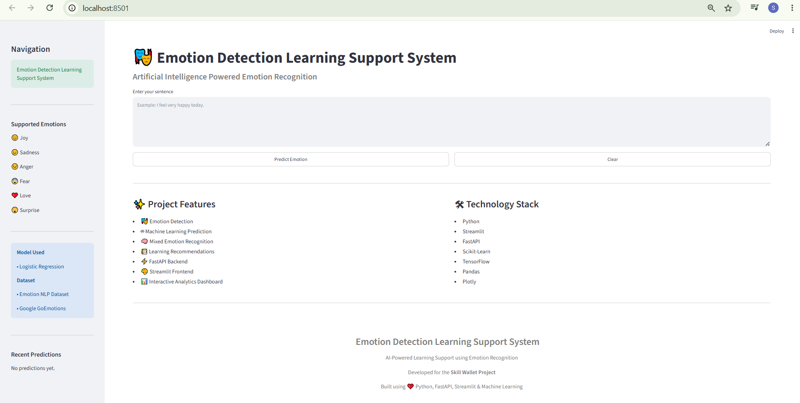
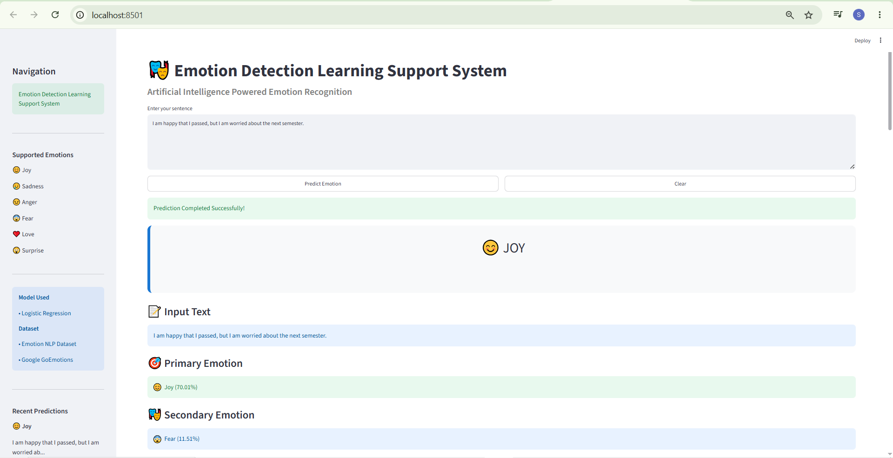
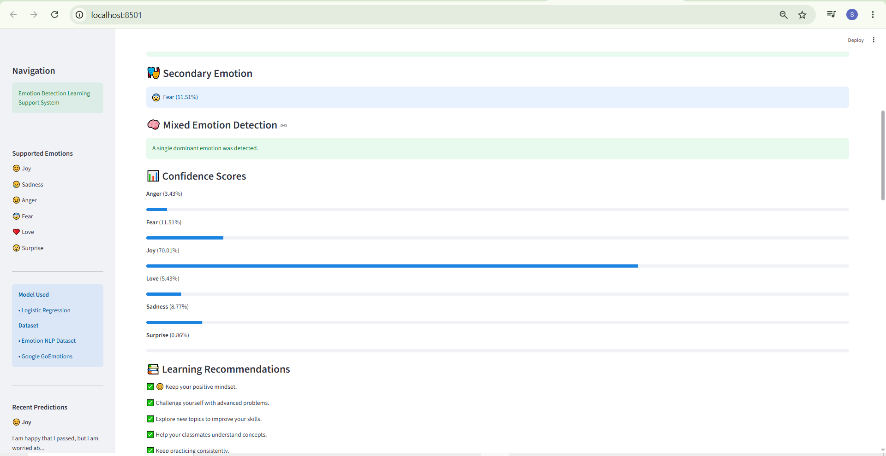
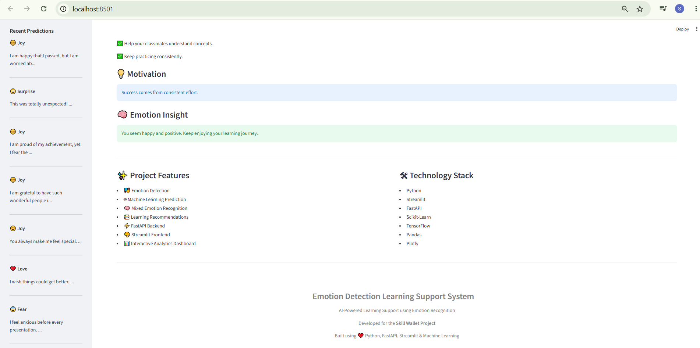
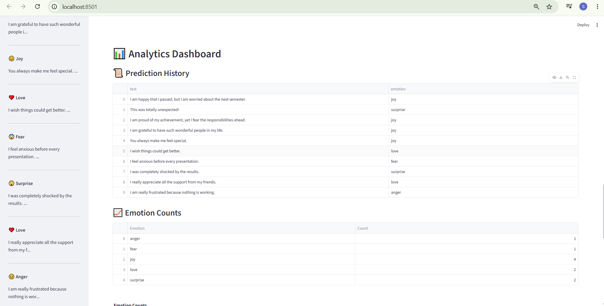
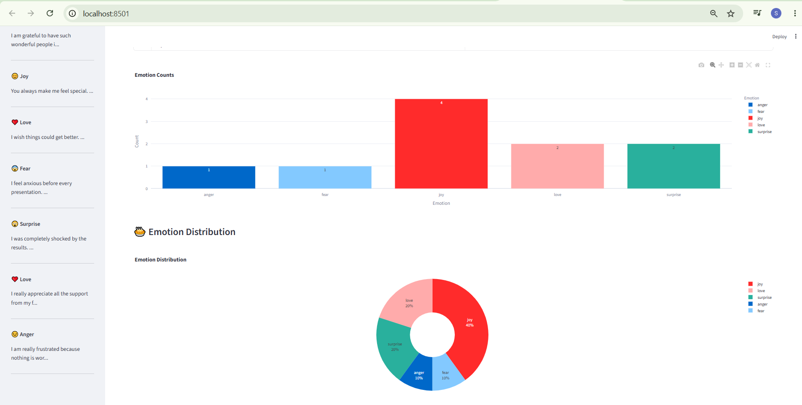
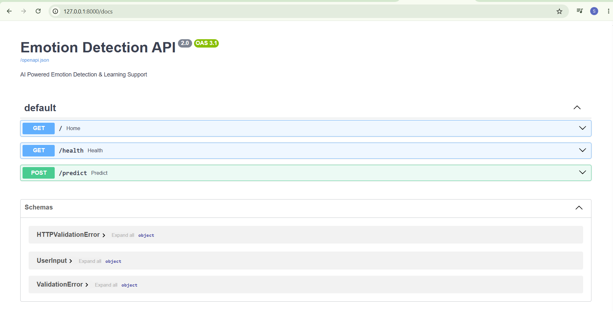
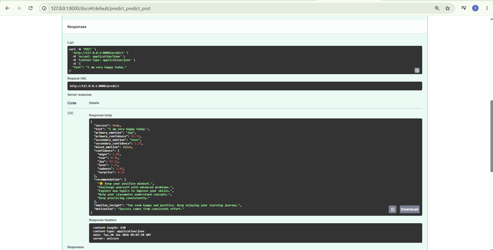

# 🎭 Emotion Detection Learning Support System

An AI-powered **Emotion Detection Learning Support System** built using **Python, FastAPI, Streamlit, and Machine Learning**. This application detects emotions from user-entered text and provides personalized learning recommendations, motivational messages, emotion insights, prediction history, and interactive analytics.

---

# 📌 Project Overview

The Emotion Detection Learning Support System is designed to recognize emotions expressed in text using Natural Language Processing (NLP) and Machine Learning techniques.

The system analyzes the user's text, predicts the dominant emotion, identifies possible mixed emotions, and provides personalized educational support through learning recommendations and motivational guidance.

---

# ✨ Features

* 🎭 Emotion Detection from text
* 😊 Detects six emotions:

  * Joy
  * Sadness
  * Anger
  * Fear
  * Love
  * Surprise
* 🧠 Mixed Emotion Detection
* 📚 Personalized Learning Recommendations
* 💡 Motivational Messages
* 📝 Emotion Insights
* 📜 Prediction History
* 📊 Analytics Dashboard
* 📈 Emotion Count Bar Chart
* 🥧 Emotion Distribution Pie Chart
* ⚡ FastAPI REST API
* 🎨 Streamlit Interactive User Interface

---

# 🛠 Technology Stack

### Programming Language

* Python

### Frontend

* Streamlit

### Backend

* FastAPI

### Machine Learning

* Scikit-learn
* Logistic Regression
* TensorFlow / Keras
* BiLSTM
* BERT

### Data Processing

* Pandas
* NumPy
* Joblib

### Visualization

* Plotly

---

# 📂 Project Structure

```text
Emotion-Detection-Learning-Support/
│
├── analytics/
├── api/
├── assets/
│   └── screenshots/
├── data/
├── frontend/
├── history/
├── models/
│   ├── logistic/
│   ├── bilstm/
│   └── bert/
├── pages/
├── prediction/
├── recommendation/
├── training/
├── README.md
├── requirements.txt
└── .gitignore
```

---

# 🚀 Installation

## Clone the Repository

```bash
git clone https://github.com/YOUR_USERNAME/Emotion-Detection-Learning-Support.git
```

## Navigate to the Project

```bash
cd Emotion-Detection-Learning-Support
```

## Create a Virtual Environment

```bash
python -m venv venv311
```

## Activate the Environment (Windows)

```bash
venv311\Scripts\activate
```

## Install Required Packages

```bash
pip install -r requirements.txt
```

---

# ▶️ Run the FastAPI Backend

```bash
uvicorn api.main:app --reload
```

Open the API documentation in your browser:

```
http://127.0.0.1:8000/docs
```

---

# ▶️ Run the Streamlit Frontend

```bash
streamlit run frontend/app.py
```

---

# 📸 Project Screenshots

# 📸 Project Screenshots

## 🏠 Home Page



---

## 🎯 Emotion Prediction (Top)



---

## 🎯 Emotion Prediction (Middle)



---

## 🎯 Emotion Prediction (Bottom)



---

## 📊 Analytics Dashboard (Top)



---

## 📊 Analytics Dashboard (Bottom)



---

## 🚀 FastAPI Documentation



---

## 🔮 FastAPI Prediction API



# 🤖 Machine Learning Models

The project implements multiple machine learning models for emotion classification:

* Logistic Regression
* BiLSTM (Bidirectional Long Short-Term Memory)
* BERT (Bidirectional Encoder Representations from Transformers)

These models were developed to compare different approaches for emotion recognition and improve overall prediction quality.

---

# 📚 Dataset

The project uses:

* Emotion Dataset
* Google GoEmotions Dataset

The datasets were preprocessed using NLP techniques such as text cleaning, TF-IDF vectorization, and label encoding before training the models.

---

# 📈 Future Enhancements

* User Authentication
* Database Integration
* Voice Emotion Detection
* Image Emotion Recognition
* Real-time Chat Emotion Analysis
* Model Comparison Dashboard
* Cloud Deployment
* Mobile Responsive Interface

---

# 👩‍💻 Author

**Ashok Ponnuri**

Skill Wallet Project

---

# 🙏 Acknowledgements

Special thanks to the open-source community and the developers of:

* Python
* FastAPI
* Streamlit
* Scikit-learn
* TensorFlow
* Plotly
* Pandas
* NumPy

for providing the tools and libraries used in this project.

---

# ⭐ Support

If you found this project useful, consider giving it a ⭐ on GitHub.

Thank you for visiting this project!
